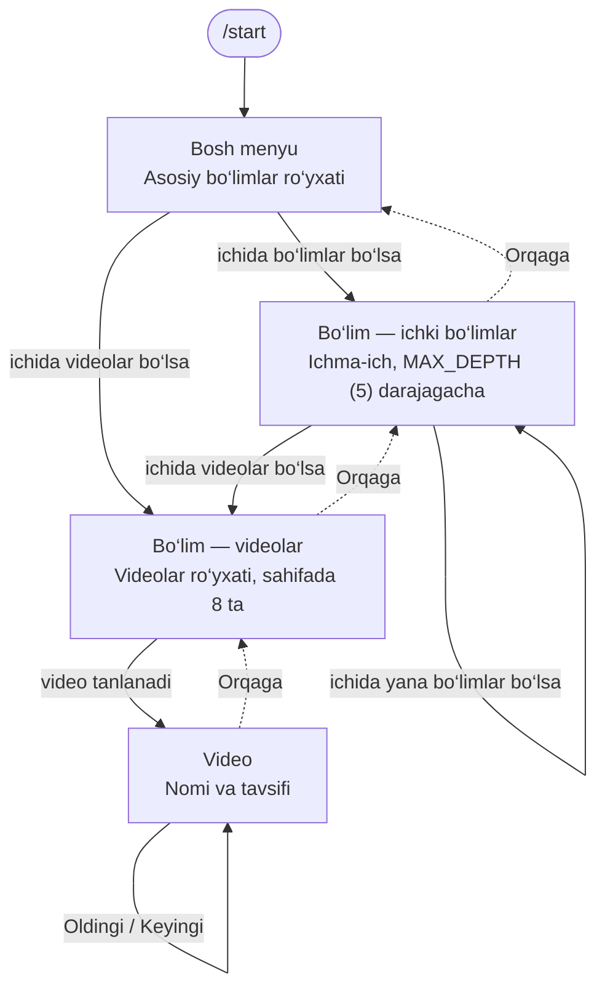

# Telegram video-bot — Texnik topshiriq (MVP)

| Hujjat    | Qiymat                           |
| --------- | -------------------------------- |
| Versiya   | 2.3 — salomlashuv rasmi           |
| Sana      | 27.09.2026                       |
| Holat     | Kelishish uchun                  |
| Interfeys | O‘zbek tili (lotin)              |

## 1. Loyiha haqida

Bot — videolar katalogi. Admin videoni yopiq video kanalga caption bilan tashlaydi, bot uni kerakli bo‘limga o‘zi qo‘shadi (admin panel orqali ham qo‘shish mumkin). Mijoz bo‘limlarni tanlab, videoni bot ichida ko‘radi. Alohida sayt kerak emas.

Uchta tamoyil:

- **Minimal** — har ekranda faqat kerakli tugmalar, ortiqcha matn yo‘q.
- **Tez** — har bir bosishga javob 1 soniyadan kam.
- **Toza chat** — navigatsiya bitta xabar ichida ishlaydi, chat xabarlarga to‘lib ketmaydi.

### 1.1 MVP doirasi

Birinchi versiyaga faqat botning asosiy vazifasi kiradi:

- **Mijoz** bo‘limlar bo‘ylab yuradi va videoni ko‘radi.
- **Admin** bo‘lim yaratadi va o‘chiradi, bo‘lim ichida bo‘lim yaratadi.
- **Admin** video qo‘shadi — video kanalga post tashlab yoki admin panelda — va o‘chiradi.

Qidiruv, bir nechta til, statistika va boshqa imkoniyatlar keyingi versiyalarda qilinadi (11-bo‘lim).

## 2. Atamalar

| Atama          | Ma’nosi                                                                  |
| -------------- | ------------------------------------------------------------------------ |
| Bo‘lim         | Videolar yoki boshqa bo‘limlar joylanadigan papka                         |
| Asosiy bo‘lim  | Bosh menyuda turadigan, ota bo‘limi yo‘q bo‘lim                          |
| Ichki bo‘lim   | Boshqa bo‘lim ichida yaratilgan bo‘lim                                    |
| Faol xabar     | Chatdagi navigatsiya ishlayotgan yagona bot xabari                        |
| file_id        | Telegram serveridagi videoning bot uchun identifikatori                   |
| Video kanal    | Yopiq Telegram kanal (`BACKUP_CHANNEL_ID`): videolar shu yerga tashlanadi; botdagi har bir videoning posti shu yerda turadi |

## 3. Rollar

| Rol   | Kim                                                            | Nima qila oladi                                                  |
| ----- | -------------------------------------------------------------- | ---------------------------------------------------------------- |
| Mijoz | /start bosgan har bir foydalanuvchi — bot hamma uchun ochiq     | Bo‘limlarni ko‘radi, videoni ochadi                              |
| Admin | ID si `ADMIN_IDS` ro‘yxatida bo‘lgan foydalanuvchi (3–4 kishi)  | Mijoz imkoniyatlari + bo‘lim va videolarni yaratish, o‘chirish   |
| Kanal admini | Video kanalga post yoza oladigan har kim | Kanalga post tashlab video qo‘shadi, captionni tahrirlab o‘zgartiradi |

## 4. Mijoz tomoni

### 4.1 Tuzilma

- Bo‘limlar daraxt ko‘rinishida: bo‘lim ichida bo‘lim bo‘lishi mumkin. Maksimal chuqurlik — `MAX_DEPTH` (standart 5).
- Bitta bo‘limda **yo ichki bo‘limlar, yo videolar** bo‘ladi — aralash emas. Bu har bir ekranni sodda qiladi: yo bo‘limlar ro‘yxati, yo videolar ro‘yxati.
- Bo‘sh bo‘limlar (ichida, jumladan chuqurroq darajalarda ham, birorta video yo‘q) mijozga ko‘rinmaydi.



Bo‘lim tanlanganda ichida nima borligiga qarab ichki bo‘limlar yoki videolar ro‘yxati ochiladi. «⬅️ Orqaga» har doim bir daraja yuqoriga qaytaradi.

### 4.2 Bosh menyu

- /start bosilganda salomlashuv va asosiy bo‘limlar ro‘yxati chiqadi. Salomlashuvni admin o‘zi yozadi (5.7); yozilmagan bo‘lsa standart matn chiqadi.
- Har bo‘lim — bitta tugma, faqat nomi (video soni ko‘rsatilmaydi).
- Bo‘lim tugmalari qatorda ikkitadan. Barcha tugmalar ko‘k rangda (`style: primary`).
- Bo‘limlar yaratilgan tartibda chiqadi.
- 8 tadan ko‘p bo‘lsa — sahifalash (4.4 dagi kabi).

```
Xush kelibsiz! Kerakli bo‘limni tanlang.

[ Bo‘lim nomi ]  [ Bo‘lim nomi ]
[ Bo‘lim nomi ]  [ Bo‘lim nomi ]
[ Bo‘lim nomi ]
```

### 4.3 Bo‘lim — ichki bo‘limlar ro‘yxati

- Bo‘lim bosilganda faol xabar tahrirlanadi (yangi xabar yuborilmaydi).
- Sarlavha — yo‘l: «Bo‘lim › Ichki bo‘lim». Yo‘l 60 belgidan uzun bo‘lsa, boshi «… ›» bilan qisqartiriladi. Sarlavha ostida admin yozgan bo‘lim matni chiqadi (5.7), yozilmagan bo‘lsa — hech narsa.
- Har ichki bo‘lim — bitta tugma, faqat nomi; qatorda ikkitadan (4.2 dagi kabi). 8 tadan ko‘p bo‘lsa — sahifalash.
- «⬅️ Orqaga» bir daraja yuqoriga, «🏠 Bosh menyu» bosh menyuga qaytaradi (asosiy bo‘limda faqat «⬅️ Orqaga»).

```
Bo‘lim nomi

[ Ichki bo‘lim nomi ]
[ Ichki bo‘lim nomi ]
[ ⬅️ Orqaga ]
```

### 4.4 Bo‘lim — videolar ro‘yxati

- Sarlavha — yo‘l va bo‘lim matni (bo‘lsa). Videolar soni ko‘rsatilmaydi.
- Video nomlari xabar matnida raqami bilan ro‘yxat bo‘lib chiqadi: «1. Video nomi». Tugmalarda faqat raqam, qatorda to‘rttadan. Raqam bo‘limdagi tartibni bildiradi va sahifadan sahifaga davom etadi (2-sahifa 9 dan boshlanadi).
- Sahifada 8 ta video. Ko‘p bo‘lsa pastda «◀️ 1/2 ▶️»; birinchi sahifada «◀️», oxirgisida «▶️» ko‘rinmaydi. «1/2» tugmasi hech narsa qilmaydi.
- «⬅️ Orqaga» va «🏠 Bosh menyu» 4.3 dagi kabi ishlaydi.
- Admin panelda ham videolar ro‘yxati xuddi shunday ko‘rinadi.

```
Bo‘lim › Ichki bo‘lim

1. Birinchi video nomi
2. Ikkinchi video nomi
...
8. Sakkizinchi video nomi

[ 1 ]  [ 2 ]  [ 3 ]  [ 4 ]
[ 5 ]  [ 6 ]  [ 7 ]  [ 8 ]
[ 1/2 ]  [ ▶️ ]
[ ⬅️ Orqaga ]  [ 🏠 Bosh menyu ]
```

### 4.5 Video

- Video tanlanganda ro‘yxat xabarining o‘zi videoga aylanadi (`editMessageMedia`): xabar o‘chirilmaydi, yangisi yuborilmaydi.
- Video ostida: nomi (qalin) va tavsif (bo‘lsa). Yo‘l va tartib raqami ko‘rsatilmaydi.
- «◀️ Oldingi» / «Keyingi ▶️» shu bo‘lim videolarini o‘sha xabarning o‘zida almashtiradi (`editMessageMedia`). Birinchi videoda «Oldingi», oxirgisida «Keyingi» ko‘rinmaydi.
- «⬅️ Orqaga» ro‘yxatni o‘sha xabarning o‘zida, **joriy video turgan sahifada** ochadi. «🏠 Bosh menyu» bosh menyuni ochadi. Telegram videoli xabarni yana oddiy matnga aylantira olmaydi, shuning uchun video o‘rniga muqova rasmi qo‘yiladi va ro‘yxat uning ostida chiqadi (6-bo‘lim).

```
[ video ]
Video nomi
Qisqa tavsif, 1–2 qator.

[ ◀️ Oldingi ]  [ Keyingi ▶️ ]
[ ⬅️ Orqaga ]  [ 🏠 Bosh menyu ]
```

### 4.6 Kutilmagan kiritishlar

- Mijoz matn, stiker, rasm yoki noma’lum buyruq yuborsa, xabar o‘chiriladi va faol xabar bosh menyuga qaytadi. Alohida javob yuborilmaydi.
- O‘chirilgan bo‘lim yoki video tugmasi bosilsa, «Bu bo‘lim o‘chirilgan» / «Bu video o‘chirilgan» qalqib chiquvchi xabar (`answerCallbackQuery`) ko‘rsatiladi va bosh menyu ochiladi.
- Botda hali birorta video bo‘lmasa, bosh menyuda salomlashuv bilan «Hozircha videolar yo‘q — tez orada qo‘shiladi» matni chiqadi.

## 5. Admin tomoni

Admin hamma ishni bot ichida bajaradi. /admin buyrug‘i admin panelni ochadi; buyruq faqat adminlar menyusida ko‘rinadi, boshqalar uchun javob bermaydi.

### 5.1 Admin panel

```
Admin panel

[ 📂 Bo‘limlar ]
[ ➕ Video qo‘shish ]
[ ✏️ Salomlashuv va matnlar ]
```

### 5.2 Bo‘limlarni boshqarish

«📂 Bo‘limlar» mijoz tomonidagidek daraxt bo‘ylab yuradi, lekin admin bo‘sh bo‘limlarni ham ko‘radi (nomi yonida «· bo‘sh»). Admin panelda bo‘lim va video sonlari ko‘rsatilmaydi.

Har bo‘lim ekranida bo‘lim holatiga qarab tugmalar chiqadi:

| Bo‘lim holati         | Tugmalar                                             |
| --------------------- | ---------------------------------------------------- |
| Bo‘sh                 | ➕ Ichki bo‘lim, ➕ Video, ✏️ Bo‘lim matni, 🗑 O‘chirish |
| Ichida bo‘limlar bor  | ➕ Ichki bo‘lim, ✏️ Bo‘lim matni, 🗑 O‘chirish          |
| Ichida videolar bor   | ➕ Video, ✏️ Bo‘lim matni, 🗑 O‘chirish                 |
| Chuqurlik = MAX_DEPTH | «➕ Ichki bo‘lim» ko‘rinmaydi                         |

Bosh ekranda (asosiy bo‘limlar ro‘yxati) — «➕ Bo‘lim».

**Bo‘lim yaratish:** bot «Bo‘lim nomini yozing» deydi → admin nom yozadi → bo‘lim yaratiladi va ro‘yxatga qaytiladi. Nom: 2–40 belgi, bir bo‘lim ichida takrorlanmaydi.

**Bo‘lim o‘chirish:**

- Har doim tasdiq so‘raladi.
- Ichi bo‘sh bo‘lmasa, bot nima o‘chishini aniq aytadi: «Ichida 3 ta bo‘lim va 24 ta video bor. Hammasi bilan birga o‘chirilsinmi?» → «🗑 Ha, o‘chirish» / «❌ Bekor qilish».

### 5.3 Video qo‘shish (admin panelda)

Ikki yo‘l bilan boshlanadi: bo‘lim ekranidagi «➕ Video» (joy allaqachon tanlangan) yoki admin paneldagi «➕ Video qo‘shish» (avval daraxt bo‘ylab joy tanlanadi; faqat video qo‘shish mumkin bo‘lgan bo‘limlar tanlanadi).

1. Bot: «Videoni yuboring». Admin videoni yuboradi yoki kanaldan forward qiladi.
2. Bot: «Video nomini yozing». Videoda caption bo‘lsa, «Captiondan olish» tugmasi chiqadi (birinchi qator olinadi).
3. Bot: «Qisqa tavsif yozing» — «O‘tkazib yuborish» tugmasi bilan.
4. Bot videoni mijoz ko‘radigan ko‘rinishda ko‘rsatadi: «✅ Saqlash» / «❌ Bekor qilish».
5. Saqlangan video bo‘lim oxiriga qo‘shiladi, darhol mijozlarga ko‘rinadi va video kanalga 5.4 dagi caption formati bilan nusxalanadi. Bot «➕ Yana qo‘shish» ni taklif qiladi.

Qoidalar:

- Har qadamda «❌ Bekor qilish» bor.
- Faqat video qabul qilinadi. Ovozsiz video Telegramda GIF (`animation`) bo‘lib kelishi mumkin — u ham qabul qilinadi. Fayl (hujjat) sifatida yuborilsa: «Videoni video sifatida yuboring».
- Nom: 2–60 belgi (tugmada to‘liq ko‘rinishi uchun 35 gacha tavsiya), emoji olib tashlanadi. Tavsif: 300 belgigacha. Captiondan olingan nom ham shu qoidalar bilan tekshiriladi.
- Bir xil video qayta qo‘shilsa (`file_unique_id` bo‘yicha), bot qayerda borligini aytib ogohlantiradi va baribir qo‘shish yoki bekor qilishni taklif qiladi.

### 5.4 Video kanal orqali qo‘shish

Video qo‘shishning asosiy yo‘li — yopiq video kanal. Admin videoni kanalga caption bilan tashlaydi, bot uni o‘zi katalogga qo‘shadi. Katalog PostgreSQL’da qoladi: mijoz bosganda bot kanalni qidirmaydi. Kanalni to‘g‘ridan-to‘g‘ri baza qilib bo‘lmaydi — Telegram Bot API botga kanal tarixini o‘qishga va post o‘chirilganini bilishga ruxsat bermaydi; bot faqat yangi va tahrirlangan postlarni ko‘radi.

Caption formati:

```
Бек офис › Финансы        ← 1-qator: bo‘lim yo‘li (› yoki > bilan)
Отчёты                    ← 2-qator: video nomi
Oylik hisobotni ko‘rish   ← 3-qatordan: tavsif (ixtiyoriy)
```

- Bo‘limlar nomi bo‘yicha topiladi, katta-kichik harf farq qilmaydi. Yo‘q bo‘lim yaratiladi va adminlarga «yangi bo‘lim yaratildi» xabari keladi — nomdagi xatoni shu yerda ko‘rish mumkin.
- Video bo‘lim oxiriga qo‘shiladi va darhol mijozlarga ko‘rinadi. Qabul qilingan postga bot 👍, qabul qilinmaganiga 👎 reaksiyasini qo‘yadi; qabul qilinmaganining sababi va post havolasi adminlarga keladi.
- Captionni tahrirlash — videoni tahrirlash: nomi, tavsifi va bo‘limi yangilanadi, bo‘lim o‘zgarsa video yangi bo‘lim oxiriga ko‘chadi. Qabul qilinmagan post tahrirlab tuzatilsa, bot uni qayta ko‘rib chiqadi.
- Admin paneldagi qoidalar amal qiladi: «yo bo‘limlar, yo videolar», nom uzunligi (bo‘lim 2–40, video 2–60, tavsif 300 belgigacha), `MAX_DEPTH`. Bo‘lim nomida › va > belgilari bo‘lmaydi. Qoida buzilsa, hech narsa yozilmaydi (yarim yaratilgan bo‘limlar qolmaydi).
- Bir xil video (`file_unique_id`) botda allaqachon bo‘lsa, post qabul qilinmaydi.
- Faqat video (va ovozsiz video — GIF) qabul qilinadi. Fayl sifatida tashlangan videoga sababi yoziladi; matn, rasm va boshqa postlar e’tiborsiz qoldiriladi.
- Albomda caption odatda faqat birinchi videoda bo‘ladi — videolarni bittadan, har biriga o‘z captioni bilan tashlang.
- Kanalda post o‘chirilsa, bot buni bilmaydi — videoni admin paneldan o‘chiring.
- Bot kanalga admin bo‘lishidan oldingi postlarni ko‘rmaydi — ularni kanalga qayta forward qiling. Bot o‘chiq bo‘lgan paytdagi postlarni Telegram 24 soatgacha saqlab turadi.
- Admin panel orqali qo‘shilgan videolar ham kanalga shu formatda nusxalanadi, shuning uchun kanalda butun katalog bir xil ko‘rinishda turadi va har qaysi postning captionini tahrirlash mumkin.

### 5.5 Video o‘chirish

Bo‘lim ichidagi video tugmasi bosilganda admin videoni ko‘radi va ostida «🗑 O‘chirish» tugmasi bor. Tasdiqdan so‘ng video o‘chiriladi, qolgan videolar tartibi siljiydi. Video kanaldagi posti o‘chirilmaydi (kerak bo‘lsa qo‘lda o‘chiriladi).

### 5.6 Xavfsizlik

Har bir admin amali (xabar ham, tugma ham) serverda `ADMIN_IDS` bo‘yicha qayta tekshiriladi. Admin bo‘lmagan foydalanuvchi eski admin tugmasini bossa ham hech narsa bajarilmaydi. Postlar faqat `BACKUP_CHANNEL_ID` kanalidan qabul qilinadi. Kanalga post yoza oladigan har kim video qo‘sha oladi, shuning uchun kanal adminlari ro‘yxatini shunga qarab tuzing.

### 5.7 Matnlar

Mijoz ko‘radigan asosiy matnlarni admin bot ichida o‘zi yozadi — dasturchisiz.

| Matn | Qayerda o‘zgartiriladi | Mijoz qayerda ko‘radi |
| --- | --- | --- |
| Salomlashuv (rasm bilan ham bo‘ladi) | Admin panel → «✏️ Salomlashuv va matnlar» | Bosh menyu (/start) |
| Katalog bo‘sh bo‘lganda | Admin panel → «✏️ Salomlashuv va matnlar» | Botda hali video bo‘lmaganda, bosh menyuda |
| Bo‘lim matni | Bo‘lim ichida → «✏️ Bo‘lim matni» | Bo‘limga kirganda, sarlavha ostida |

- Matn tanlanganda bot uni mijoz ko‘radigandek ko‘rsatadi (rasm bo‘lsa — rasm bilan), tagida tugmalar: «✏️ Matnni o‘zgartirish», «🖼 Rasm qo‘yish» / «🖼 Rasmni almashtirish» (faqat salomlashuvda), «🗑 Rasmni olib tashlash» (rasm bo‘lsa), «↩️ Standart holatga qaytarish» (o‘zgartirilgan bo‘lsa), «⬅️ Orqaga». Saqlangandan keyin bot yana shu ko‘rinishni yangilangan holda ko‘rsatadi.
- Admin yangi matnni oddiy xabar qilib yuboradi. Telegram formatlashi (qalin, kursiv, havola va h.k.) saqlanadi; premium (custom) emoji oddiy emojiga almashtiriladi.
- Matn 1000 belgigacha (rasm izohiga sig‘ishi uchun). Matn bo‘lmagan xabar yoki uzun matn qabul qilinmaydi, bot sababini aytib qayta so‘raydi.
- **Salomlashuv rasmi.** «🖼 Rasm qo‘yish» bosilgach admin rasm yuboradi: izoh (caption) bilan — rasm ham, matn ham yangilanadi; izohsiz — faqat rasm almashadi, matn qoladi. «✏️ Matnni o‘zgartirish» orqali matn o‘zgarsa, rasm qoladi. «🗑 Rasmni olib tashlash» faqat rasmni olib tashlaydi. Rasm bo‘lsa, bosh menyu rasm bo‘lib chiqadi: tagida salomlashuv matni va bo‘lim tugmalari. Bosh menyudan bo‘limga o‘tishda rasm xabari o‘chirilib, ro‘yxat yangi xabar bo‘lib chiqadi; videodan bosh menyuga qaytishda rasm shu xabarning o‘zida almashadi. Rasm yuborilmasa (masalan, bot almashib eski `file_id` ishlamasa), bosh menyu rasmsiz chiqadi — adminga rasmni qayta yuklash kifoya. Rasm faqat salomlashuvga qo‘yiladi; fayl sifatida yuborilgan rasm qabul qilinmaydi.
- Ro‘yxatda o‘zgartirilgan matnlar «· o‘zgartirilgan» belgisi bilan chiqadi. «↩️ Standart holatga qaytarish» admin matnini va rasmini o‘chiradi, standart matn qaytadi; bo‘lim matni «🗑 Matnni olib tashlash» bilan olib tashlanadi.
- Standart matnlar va tugma nomlari `locales/uz.toml` faylida turadi (dasturchi o‘zgartiradi).

## 6. Interfeys qoidalari

Bot mobil ilovadek ishlaydi: chatda bir vaqtda faqat bitta faol bot xabari turadi.

- Faqat inline tugmalar. Pastki klaviatura ishlatilmaydi.
- Ekrandan ekranga o‘tish — faol xabarni tahrirlash, jumladan ro‘yxatdan videoga o‘tish va qaytish ham: bitta kartochka, eski xabar o‘chirilmaydi.
- Xabarda rasm yoki video paydo bo‘lgach, matnli ekranlar rasm ostida (caption) chiqadi. Rasm — salomlashuv rasmi, u qo‘yilmagan bo‘lsa — standart muqova (`assets/cover.png`). Rasm turgan bo‘lsa, faqat matn va tugmalar almashadi.
- Yangi xabar faqat Telegram tahrirlashga yo‘l qo‘ymaganda yuboriladi: xabar 48 soatdan eski, matn rasm ostiga sig‘maydi (1024 belgidan uzun), yoki admin matnni mijoz ko‘radigandek rasmsiz ko‘rishi kerak.
- Faol xabar id si bazada saqlanadi (`users.last_message_id`) — /start yoki matn kelganda eskisini topib o‘chirish uchun.
- Bot 48 soatdan eski xabarni o‘chira olmaydi — bunday holda xato chiqmaydi, shunchaki yangi xabar yuboriladi.
- Mijoz yuborgan xabarlar o‘chiriladi, chat toza qoladi.
- Emoji faqat harakat tugmalarida (⬅️ ◀️ ▶️ 🏠, adminda ➕ ✅ ❌ 🗑 📂). Bo‘lim va video tugmalarida emoji yo‘q.
- Tugma bosilganda yuklanish belgisi darhol yo‘qoladi (`answerCallbackQuery`).
- Tez ketma-ket bosishlar bitta foydalanuvchi uchun navbat bilan bajariladi (ikkita video yuborilmaydi). «message is not modified» xatosi e’tiborsiz qoldiriladi.
- Barcha interfeys matnlari bitta til faylida saqlanadi — kodni o‘zgartirmasdan tahrirlanadi va keyinchalik boshqa tillar qo‘shilishiga tayyor.
- Buyruqlar menyusi: /start; adminlarda qo‘shimcha /admin.

## 7. Ma’lumotlar tuzilishi

Videoning o‘zi serverda saqlanmaydi — bazada faqat Telegram `file_id` turadi.

**users** — foydalanuvchilar

| Maydon               | Turi      | Izoh                                  |
| -------------------- | --------- | ------------------------------------- |
| id                   | bigint    | Telegram user_id                      |
| first_name, username | text      | Telegramdagi ism va username          |
| last_message_id      | bigint    | Faol bot xabari (6-bo‘lim)            |
| created_at           | timestamp | Birinchi /start vaqti                 |
| last_active_at       | timestamp | Oxirgi faollik                        |

**categories** — bo‘limlar

| Maydon     | Turi      | Izoh                                                         |
| ---------- | --------- | ------------------------------------------------------------ |
| id         | serial    | Bazadagi raqam                                               |
| parent_id  | int, null | Ota bo‘lim; null — asosiy bo‘lim. O‘chirishda kaskad         |
| title      | text      | 2–40 belgi, bir ota ichida takrorlanmaydi                    |
| intro      | text      | Bo‘lim matni (5.7), HTML, ixtiyoriy                          |
| depth      | smallint  | 1 dan MAX_DEPTH gacha                                        |
| position   | int       | Tartib (yaratilish tartibi)                                  |
| created_by | bigint    | Yaratgan admin                                               |
| created_at | timestamp | Yaratilgan vaqt                                              |

**bot_texts** — admin o‘zgartirgan matnlar (5.7); qatori yo‘q matn standart holatda

| Maydon     | Turi      | Izoh                                     |
| ---------- | --------- | ---------------------------------------- |
| key        | text      | Matn kaliti: `main_menu`, `main_menu_empty` |
| value      | text      | Matn (HTML); bo‘sh — standart matn       |
| photo_file_id, photo_unique_id | text | Salomlashuv rasmi (bo‘lsa)  |
| updated_by | bigint    | O‘zgartirgan admin                       |
| updated_at | timestamp | O‘zgargan vaqt                           |

**videos** — videolar

| Maydon            | Turi      | Izoh                                          |
| ----------------- | --------- | --------------------------------------------- |
| id                | serial    | Bazadagi raqam                                |
| category_id       | int       | Bo‘lim id si. O‘chirishda kaskad              |
| title             | text      | 2–60 belgi                                    |
| description       | text      | 300 belgigacha, ixtiyoriy                     |
| file_id           | text      | Videoni qayta yuborish uchun                  |
| file_unique_id    | text      | Takrorni aniqlash uchun (indeks)              |
| media_type        | text      | `video` yoki `animation`                      |
| backup_message_id | bigint    | Video kanaldagi posti (5.4) — tahrir shu bo‘yicha topiladi |
| position          | int       | Bo‘lim ichidagi tartib                        |
| created_by        | bigint    | Qo‘shgan admin (kanaldan qo‘shilganda bo‘sh)  |
| created_at        | timestamp | Qo‘shilgan vaqt                               |

«Yo bo‘limlar, yo videolar» qoidasi va `MAX_DEPTH` ilova darajasida tekshiriladi.

## 8. Texnik va nofunksional talablar

| Talab              | Qiymat                                                                                    |
| ------------------ | ----------------------------------------------------------------------------------------- |
| Dasturlash tili    | Python 3.11+, aiogram 3.x (dasturchi boshqasini asoslab taklif qilishi mumkin)             |
| Ma’lumotlar bazasi | PostgreSQL, migratsiyalar bilan (Alembic)                                                  |
| Videolarni saqlash | Telegram serverida, bazada file_id. Bot faylni yuklab olmaydi                              |
| Video hajmi        | Telegram ruxsat bergan hajmgacha (oddiy akkauntda 2 GB)                                    |
| Zaxira             | Har bir videoning posti yopiq video kanalda turadi; baza har kuni `pg_dump` qilinib, shu kanalga yuboriladi |
| Himoya             | O‘chirilgan (mijoz videoni forward qila oladi). Kerak bo‘lsa `PROTECT_CONTENT=true`         |
| Ishga tushirish    | Docker Compose, webhook (HTTPS domen); VPS 1 vCPU / 1 GB RAM yetarli                       |
| Sozlamalar (.env)  | BOT_TOKEN, ADMIN_IDS, DATABASE_URL, BACKUP_CHANNEL_ID, WEBHOOK_URL, WEBHOOK_SECRET, PROTECT_CONTENT, MAX_DEPTH |
| Tezlik             | Tugma bosilgandan javobgacha 1 soniyadan kam; video yuklanishi Telegram tezligiga bog‘liq  |
| Hajm               | 10 000 foydalanuvchi va 1 000 videogacha sekinlashmasdan                                   |
| Loglar             | Xatolar logga yoziladi; jiddiy xatolar haqida adminlarga Telegram orqali xabar keladi      |
| Topshiriladi       | Manba kod (Git), til fayli, README (o‘rnatish va ishga tushirish), arxivdan tiklash skripti |

Muhim texnik eslatmalar:

- **file_id faqat shu botga tegishli.** Bot almashsa, tiklash skripti har bir videoni `backup_message_id` bo‘yicha video kanaldan `forwardMessage` qiladi va javobdagi yangi `file_id` ni bazaga yozadi. Shuning uchun video kanal majburiy, bot unda post yoza oladigan admin bo‘lishi kerak, kanalda «Restrict saving content» o‘chiq turadi.
- **Tugmalar holatni o‘zida saqlaydi** (`callback_data`, 64 baytgacha), masalan `c:12:p:2`. Bot qayta ishga tushsa ham eski tugmalar ishlaydi.
- Kanal postlari `channel_post` va `edited_channel_post` yangilanishlari orqali keladi va kanal bo‘yicha navbat bilan (tashlangan tartibda) ishlanadi.
- Kanalga nusxalash navbat orqali bajariladi va Telegram 429 javobida `retry_after` ni kutadi.
- Ishga tushishda Telegram vaqtincha ulanmasa, bot to‘xtab qolmaydi — ulanishni 1, 2, 4 … 60 soniya oralig‘ida qayta urinadi.

## 9. Qabul qilish mezonlari

Bot quyidagilarning barchasi bajarilganda qabul qilinadi:

- [ ] Admin asosiy bo‘lim, uning ichida bo‘lim va `MAX_DEPTH` gacha chuqurroq bo‘limlar yarata oladi.
- [ ] Videosi bor bo‘limga ichki bo‘lim, ichki bo‘limi bor bo‘limga video qo‘shib bo‘lmaydi.
- [ ] Admin panelda qo‘shilgan video darhol mijozga ko‘rinadi va video kanalda 5.4 formatidagi caption bilan paydo bo‘ladi.
- [ ] Kanalga to‘g‘ri captionli video tashlansa, u ko‘rsatilgan bo‘limda paydo bo‘ladi, yo‘q bo‘limlar yaratiladi, postga 👍 qo‘yiladi.
- [ ] Captioni noto‘g‘ri post qo‘shilmaydi (bazada hech narsa o‘zgarmaydi), postga 👎 qo‘yiladi, adminlarga sababi keladi; caption tuzatilgach video qo‘shiladi.
- [ ] Post captioni tahrirlansa, videoning nomi, tavsifi va bo‘limi yangilanadi.
- [ ] Boshqa kanal yoki chatdagi postlar, matn va rasm postlari e’tiborsiz qoldiriladi.
- [ ] Bo‘lim o‘chirilganda bot ichidagi bo‘lim va videolar sonini aytib tasdiq so‘raydi; tasdiqdan so‘ng hammasi o‘chadi.
- [ ] Video o‘chirilgach, qolganlarining raqamlari va Oldingi/Keyingi to‘g‘ri ishlaydi.
- [ ] Bo‘sh bo‘limlar (barcha ichki darajalarida birorta video yo‘q) mijozga ko‘rinmaydi.
- [ ] Oldingi/Keyingi bo‘lim ichida to‘g‘ri ishlaydi; birinchi va oxirgi videoda ortiqcha tugma yo‘q.
- [ ] «Orqaga» bir daraja yuqoriga, «🏠 Bosh menyu» bosh menyuga qaytaradi; videodan «Orqaga» joriy video turgan sahifani ochadi.
- [ ] Navigatsiya paytida chatda bitta faol bot xabari qoladi, mijoz yozgan xabarlar o‘chiriladi.
- [ ] O‘chirilgan video yoki bo‘limning eski tugmasi bosilsa, bot xato bermaydi.
- [ ] Bot qayta ishga tushgandan keyin eski xabarlardagi tugmalar ishlaydi.
- [ ] Tugmani tez ikki marta bosish ikkita video yubormaydi.
- [ ] Admin bo‘lmagan foydalanuvchi admin panelga kira olmaydi va eski admin tugmalari u uchun ishlamaydi.
- [ ] Tiklash skripti yangi bot tokeni bilan barcha videolarni video kanaldan qayta tiklaydi.
- [ ] Admin salomlashuvni o‘zgartirsa, mijoz /start bosganda yangi matnni (formatlashi bilan) ko‘radi; «Standart matnga qaytarish»dan keyin standart matn qaytadi.
- [ ] Admin bo‘lim matnini yozsa, mijoz bo‘limga kirganda uni sarlavha ostida ko‘radi; olib tashlansa, ko‘rinmaydi.
- [ ] Admin salomlashuvga rasm qo‘ysa, mijoz /start bosganda rasm, uning tagida salomlashuv va bo‘limlar chiqadi; rasm olib tashlansa, bosh menyu matn bo‘lib qaytadi.
- [ ] Admin bo‘lmagan foydalanuvchi matnlarni o‘zgartira olmaydi.

## 10. Bosqichlar

| Bosqich | Natija                                                               |
| ------- | -------------------------------------------------------------------- |
| 1       | Baza, bo‘lim daraxti, admin: bo‘lim yaratish/o‘chirish                |
| 2       | Admin: video qo‘shish/o‘chirish, arxiv kanal                          |
| 3       | Mijoz navigatsiyasi, video ekrani, «bitta faol xabar» qoidasi         |
| 4       | Docker, webhook, backup, tiklash skripti, README; qabul testlari      |
| 5       | Video kanal orqali qo‘shish va tahrirlash                             |
| 6       | Admin yozadigan matnlar: salomlashuv, bo‘lim matni                    |

## 11. Keyingi versiyalarda

Quyidagilar MVP’ga kirmaydi va keyingi update versiyalarida qilinadi:

- Qidiruv (xato yozilgan, kirill va boshqa tildagi so‘rovlar bilan).
- Bir nechta til (o‘zbekcha kirill, ruscha, ozarbayjoncha) va kontent tarjimalari.
- Statistika (foydalanuvchilar, ko‘rishlar).
- Barcha foydalanuvchilarga xabar yuborish.
- Admin panelda bo‘lim va video nomini/tavsifini tahrirlash, videoni almashtirish, ko‘chirish, yashirish, tartibni o‘zgartirish (videoni hozir kanal postining captioni orqali tahrirlash mumkin).
- Web admin panel, to‘lov, kanalga majburiy obuna, inline rejim.

Ma’lumotlar tuzilishi bularga tayyor: interfeys matnlari til faylida, tugmalar holatni o‘zida saqlaydi.

## 12. Ochiq savollar

Quyidagilar aniqlanguncha o‘ng ustundagi taxmin amal qiladi.

| #   | Savol                                                      | Hozirgi taxmin                                       |
| --- | ---------------------------------------------------------- | ---------------------------------------------------- |
| 1   | Bo‘limlar necha darajagacha ichma-ich bo‘ladi?              | `MAX_DEPTH` = 5, sozlamada o‘zgartiriladi            |
| 2   | Bitta bo‘limda ham bo‘lim, ham video bo‘lishi kerakmi?     | Yo‘q — yo bo‘limlar, yo videolar                     |
| 3   | Bo‘lim va videolar tartibi qanday belgilanadi?              | Yaratilish tartibida; o‘zgartirish keyingi versiyada |
| 4   | Webhook uchun domen va server kim tomonidan beriladi?       | Buyurtmachi                                          |
